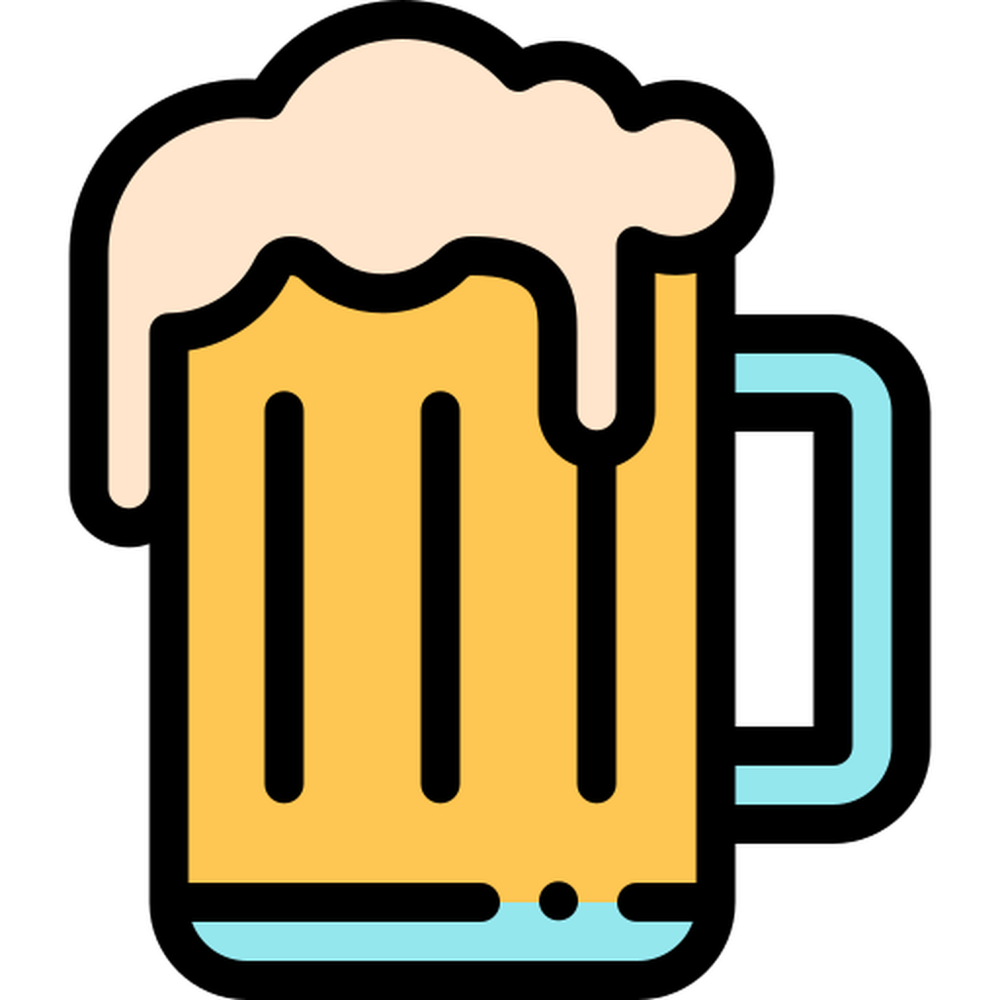

<p align="center">
    
</p>
<h1 align="center">AICTest</h1>
<p align="center">
Cool audiobot for Discord created by <a href="https://vk.com/alexincube"><b>@AlexInCube</b></a></p>

## 🌟 Features
- Command /alcotest which shows your alcohol count in blood
- Audioplayer based on [Distube](https://github.com/skick1234/DisTube) with buttons 
- Support YouTube, Spotify, Soundcloud, any HTTP-stream and Discord Attachments (/playfile support MP3/WAV/OGG)
- Support Slash and Text commands (with customizable prefix per server using /setprefix)
- Localization (English and Russian are currently supported)

## 🎛️ Requirements
- Node.js 18 or higher
- MongoDB 6.0 or higher
- ffmpeg latest

## How to run bot?
### ⚙️ Configure .env
You can use Docker image or install things from "Requirements" and source code locally.
But in both cases, you need to configure .env file.

- Create .env.production
- Fill all fields in .env.production. If the field is marked as (Optional), you can skip it.
- (Required) To get Discord Token, follow this [guide](https://discordjs.guide/preparations/setting-up-a-bot-application.html#creating-your-bot). After following the guide, you need to enable privileged intents in [Discord Developer Portal.](https://github.com/AlexInCube/AlCoTest/assets/25522245/fdbcdcf1-9501-47f0-93bf-7e76806f623f)
- (Optional) To get Spotify Secret and ID, follow this [guide](https://stevesie.com/docs/pages/spotify-client-id-secret-developer-api)
- (Optional) To get Yandex Music token, follow this [guide](https://github.com/MarshalX/yandex-music-api/discussions/513)
```
BOT_VERBOSE_LOGGING=<boolean> (Optional) The bot will give more information about what it is doing to the console, useful for debugging. By default is: false

BOT_COMMAND_PREFIX=<default prefix you want> (Required) Used only for text commands, for example: //
BOT_LANGUAGE=<language> (Optional) Supported values: en ru. By default is: en

MONGO_URI=<ip to mongodb> (Required) If you run bot locally, use mongodb://localhost:27017. If you run in Docker, use mongodb://mongo:27017
MONGO_DATABASE_NAME=<any name you want> (Required) Database name in MongoDB, for example: aicbot

BOT_DISCORD_TOKEN=<discord token> (Required) 
BOT_DISCORD_CLIENT_ID=<discord bot id> (Required) 
BOT_DISCORD_OVERPOWERED_ID=<your id in discord> (Required) This need to retrieve reports in direct message

BOT_SPOTIFY_CLIENT_SECRET=<spotify secret> (Optional)
BOT_SPOTIFY_CLIENT_ID=<spotify id> (Optional)

BOT_YANDEXMUSIC_TOKEN=<yandexmusic token> (Optional)
```

### 🍪 Youtube Cookie
Also, it is preferable to provide cookies for YouTube.
This will allow you to play 18+ videos and bypass YouTube rate limiting error (429 Error).
I highly recommend that you create a new Google account from which you get the cookie.
You cannot watch videos in your browser from this account,
otherwise your cookie will be reset, and you will need to retrieve it again.

- Install an extension for extracting cookie, [EditThisCookie](https://www.editthiscookie.com/blog/2014/03/install-editthiscookie/)
- Go to [YouTube](https://www.youtube.com/)
- Log in to your account. (You should use a new account for this purpose)
- Click on the extension icon and click "Export" button.
- Create file yt-cookies.json and paste cookie in this file

### 🖥️ Run locally
- Install things from "Requirements" section
- Follow the "Configure .env" section and put .env.production in folder with repository.
- Follow the "YouTube Cookie" section and put yt-cookies.json in the folder with repository.
- Run commands below

```npm
npm install
npm run build
npm run production
```

### 🐋 Run in Docker
- Copy docker-compose.yml, Dockerfile, runInDocker.bat (for Windows) or runInDocker.sh (for Linux) in empty folder
- Follow the "Configure .env" section and put .env.production in folder with Dockerfile etc.
- Follow the "YouTube Cookie" section and put yt-cookies.json in the folder with Dockerfile etc.
- Run "runInDocker" file
