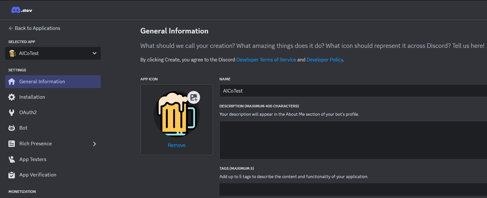
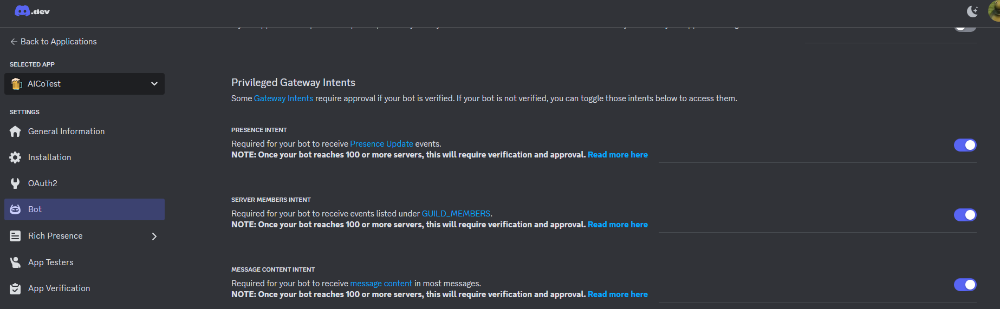
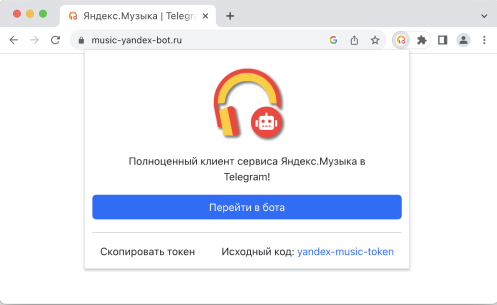
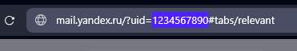
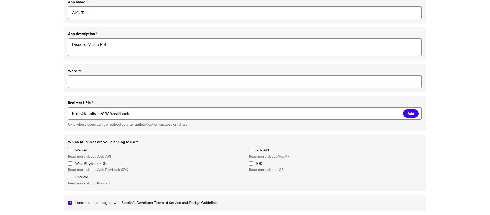

[!CAUTION]
Don't share this API data with anyone because you can get compromised.
If this happens, reset the tokens and get them again.

## Discord Developer Portal (required)

1. Open the [Discord Developer Portal](https://discord.com/developers/applications) and log into your account.
2. Click on the "New Application" button.
3. Enter a name and confirm the pop-up window by clicking the "Create" button.

You should see a page like this:

You can edit your application's name, description, and avatar here. Once you've done that, then congratulations—you're now the proud owner of a shiny new Discord bot! You're not entirely done, though.

4. On "General Information" page copies the Application ID, this is your Client ID.
5. On the sidebar select section "Bot"
6. Press "Reset token" button and copy token.
7. Also enable all "Privileged Gateway Intents"

## YouTube Cookie (optional)
Preferable to provide cookies for YouTube.
This will allow you to play 18+ videos and bypass YouTube rate limiting error (429 Error).
I highly recommend that you create a new Google account from which you can get the cookie.

[!WARNING]
Time to time, cookies are resets by YouTube, so you need to retrieve it again.
It's so annoying, but hasn't figured out a way to automate the cookie retrieval process.
If you know workaround, please create the [issue](https://github.com/AlexInCube/AlCoTest/issues/new/choose)

1. Install an extension for extracting cookie, [EditThisCookie](https://www.editthiscookie.com/blog/2014/03/install-editthiscookie/)
2. Go to [YouTube](https://www.youtube.com/)
3. Log in to your account. (You should use a new account for this purpose)
4. Click on the extension icon and click "Export" button.
5. Create file yt-cookies.json and paste cookie in this file

## Yandex Music (optional)
If you do not provide token and UID, Yandex Music will not work at all.

[!WARNING]
If your bot is outside Russia VDS, you must have a Yandex Plus subscription to play songs.

### Token
1. Login into [Yandex](https://passport.yandex.ru/auth) account. 
2. Download [browser extension](https://chromewebstore.google.com/detail/yandex-music-token/lcbjeookjibfhjjopieifgjnhlegmkib)
This must look like this 
3. Click "Скопировать токен" button.

### UID
1. Login into [Yandex](https://passport.yandex.ru/auth) account.
2. You can retrieve uid by opening [Yandex Mail](https://mail.yandex.ru) and copy uid from the url in the address bar.

## Spotify (optional)
Spotify Module can work without provided data, but for more stability better provide custom application data.

[!WARNING]
If you want to fetch playlist with more than 100 songs, this API data is required!

1. Login in [Spotify Developer Dashboard](https://developer.spotify.com/dashboard)
2. Press "Create app" button
3. Fill the fields like this
4. Press "Save"
5. On the redirected page, press "Settings"
6. On "Basic Information" section copy Client ID.
7. Under the Client ID field, press "View Client Secret" and copy Client Secret.

## Soundcloud (optional)

1. Go to [SoundCloud](https://soundcloud.com) and login.
2. Open up the dev tools (Right-click -> inspect) and go to the Network tab.
3. Refresh the page with opened dev tools.
4. Find the request that has the name session (you can filter by typing session in the filter box) and click on it
5. Go to the Payload tab
6. You should see your client id in the Query String Parameters section, and your oauth token (access_token) in the Request Payload section
