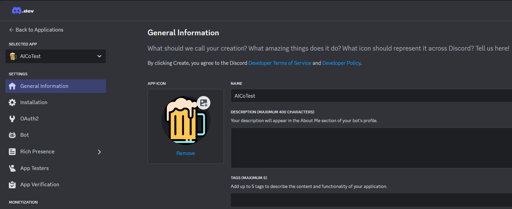
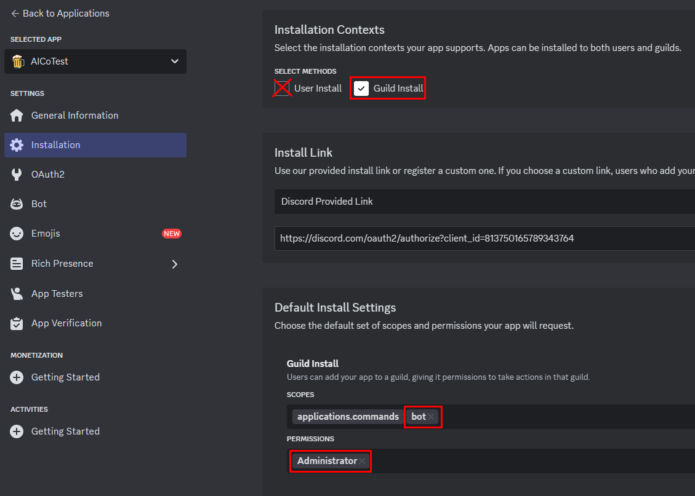
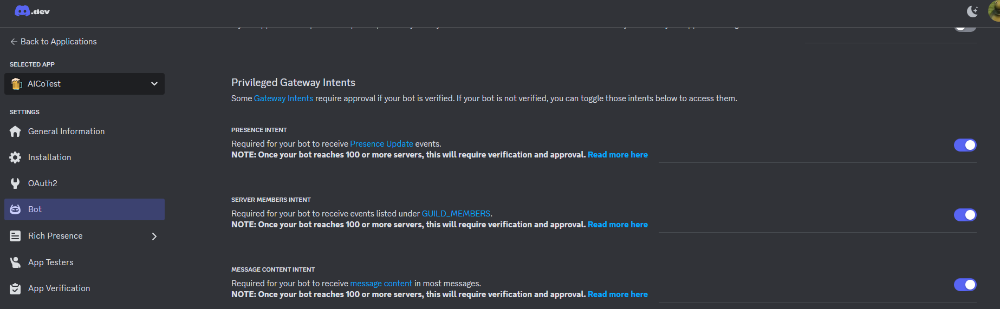
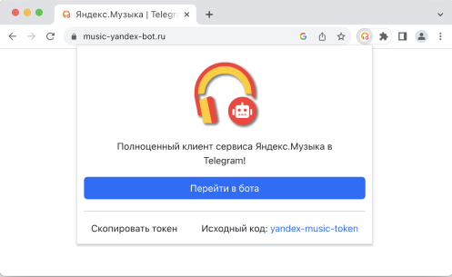
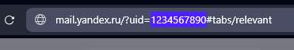
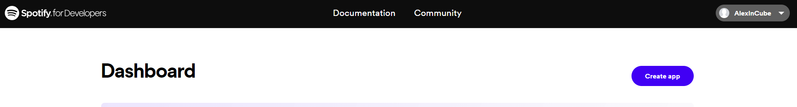
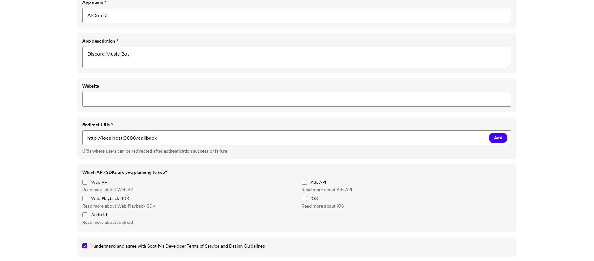

> [!CAUTION]
> Don't share this API data with anyone because you can get compromised.
> If this happens, reset the tokens and get them again.

# Discord Developer Portal (required)

1. Open the [Discord Developer Portal](https://discord.com/developers/applications) and log into your account.
2. Click on the "New Application" button.
3. Enter a name and confirm the pop-up window by clicking the "Create" button.

You should see a page like this:

You can edit your application's name, description, and avatar here. Once you've done that, then congratulations—you're now the proud owner of a shiny new Discord bot! You're not entirely done, though.

4. Go to "Installation" page
5. In "Installation Contexts" disable "User Install", enable "Guild install"
6. In "Default Install Settings" add scope "Bot" and permission "Administrator"

Now your installation page must look like this

7. On "General Information" page copies the Application ID, this is your Client ID.
8. On the sidebar select section "Bot"
9. Press "Reset token" button and copy token.
10. Also enable all "Privileged Gateway Intents"

# YouTube Cookie (optional)

Preferable to provide cookies for YouTube.
This will allow you to play 18+ videos and bypass YouTube rate limiting error (429 Error).

> [!WARNING]
> Time to time, cookies are resets by YouTube, so you need to retrieve it again.

> [!NOTE]
> I highly recommend that you create a new Google account from which you can get the cookie.

## Manual extract cookies

1. Install any extension for extracting cookie, for example, [EditThisCookie](https://www.editthiscookie.com/blog/2014/03/install-editthiscookie/)
2. Go to [YouTube](https://www.youtube.com/)
3. Log in to your account. (You should use a new account for this purpose)
4. Click on the extension icon and click "Export" button.
5. Create file yt-cookies.json and paste cookie in this file

## Automation cookies fetch

> [!WARNING]
> Disable two-factor auth on Gmail or script can't bypass the Google protection

1. Create file yt-cookies.json (don't paste anything in this file)
2. Fill the fields BOT_GOOGLE_EMAIL and BOT_GOOGLE_PASSWORD in .env file

# Yandex Music (optional)

If you do not provide token and UID, Yandex Music will not work at all.

> [!WARNING]
> If your bot is outside Russia VDS, you must have a Yandex Plus subscription to play songs.

## Token

1. Login into [Yandex](https://passport.yandex.ru/auth) account.
2. Download [browser extension](https://chromewebstore.google.com/detail/yandex-music-token/lcbjeookjibfhjjopieifgjnhlegmkib)
   This must look like this 
3. Click "Скопировать токен" button.

## UID

1. Login into [Yandex](https://passport.yandex.ru/auth) account.
2. You can retrieve uid by opening [Yandex Mail](https://mail.yandex.ru) and copy uid from the url in the address bar.
   

# Spotify (optional)

Spotify Module can work without provided data, but for more stability better provide custom application data.

> [!WARNING]
> If you want to fetch playlist with more than 100 songs, this API data is required!

1. Login in [Spotify Developer Dashboard](https://developer.spotify.com/dashboard)
2. Press "Create app" button
3. Fill the fields like this
4. Press "Save"
5. On the redirected page, press "Settings"
6. On "Basic Information" section copy Client ID.
7. Under the Client ID field, press "View Client Secret" and copy Client Secret.

# Soundcloud (optional)

1. Go to [SoundCloud](https://soundcloud.com) and login.
2. Open up the dev tools (Right-click -> inspect) and go to the Network tab.
3. Refresh the page with opened dev tools.
4. Find the request that has the name session (you can filter by typing session in the filter box) and click on it
5. Go to the Payload tab
6. You should see your client id in the Query String Parameters section, and your oauth token (access_token) in the Request Payload section

# VKontakte (optional)

1. Token is required, to get it, follow the [link](https://oauth.vk.com/authorize?client_id=2685278&scope=65536&response_type=token&revoke=1)
2. Click "Allow"
3. Copy everything between access_token= and &expires_in

# Genius (optional)

> [!WARNING]
> Provide to enable /lyrics command and lyrics button in audioplayer

1. Go to [Genius](https://genius.com/login) and login.
2. Go to [Genius Developer Dashboard](https://genius.com/api-clients/new) and create a new app
3. Generate and copy client access token

