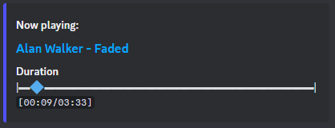

# About command system

Bot supports slash and text command systems.

## Slash commands

Nothing special, start writing / and select command from the list

## Text commands

If a bot owner does not change the default prefix in .env.production file, the prefix is //

> [!NOTE]
> If bot prefix conflicting with another bot on server,
> administrator can set the second text prefix for server using [/setPrefix](#setprefix) command

# Commands list

## Admin

It Can be used only by server administrators (people who have a role with "Administrator" permission)

### setPrefix

Changes bot prefix for the server

Example: /newPrefix $$

Prefix symbols cannot be symbols: / @ #, because these symbols reserved for Discord purpose.
Prefix length cannot be longer than two symbols.

## Audio

The bot philosophy built around audioplayer to reduce commands using.

Use [/play](#play) or [/playfile](#playfile) to spawn audioplayer

Most of the time of using bot, you need only add songs by [/play](#play) or [/playfile](#playfile)

When any message created in chat where audioplayer is spawned,
bot will recreate the player so that the player is always at the bottom of the chat room.

> [!NOTE]
> Highly recommended to create a text channel for the bot

> [!WARNING]
> Audio commands which change audioplayer state require audioplayer and be with bot in the same voice channel to exist.
> Also this kind of commands needs to be written in the same channel where audioplayer was spawned.

### play

Example: /play https://open.spotify.com/track/46gSk82duJtX3TTA182ruG?si=c668ab77755f4d88

Spawn audioplayer in a text channel if not exists.
Accept songs/playlist from links.
Support searching on YouTube
when you write something like this 

### playfile

Do the same things as play command, but accept MP3/WAV/OGG files instead of text/links

### playing

Return the current playback time of the song

### download

Accept links you songs and return mp3 file in a text channel where the command is called.

Example: /download https://www.youtube.com/watch?v=60ItHLz5WEA

### jump

If your queue has a large count of songs, you can jump to the desired song.
To get the number of songs you want, press the button in audioplayer to get a queue songs list.

Example: /jump 4

### previous

Returns to previous played/skipped song in queue

### rewind

Allow you to change the current playback time.
Accept time in HH:MM:SS or MM:SS or SS format.

Example: 1:02:32

### shuffle

Shuffle the next songs in the queue

### skip

Skip current playing song

### stop

Kill the audioplayer

### lyrics

Example: /lyrics faded alan walker

Searching a provided query for song lyrics and return text

### 247

Toggle 24/7 mode.
If enabled, bot will stay in a channel when no remain songs to play.
And when all users leave a voice channel with bot

### audiodebug

Give the current count of spawned audioplayers

> [!NOTE]
> This command supported only by text command system
> Also you must be overpowered user.

## Fun

### alcotest

Generate random number for 0 to 100

## Info

### help

Return the command list or certain command description

Command list example: /help
Certain command example: /help play

### inviteLink

Return the link for inviting the bot. Give the link to the administrator on another server.

### status

Return bot status data, about: OS, Ram Usage, Cpu Model, Cpu Usage, AICoTest Version, Servers Count.

### report

Return links to GitHub Issues or GitHub Discussions.
